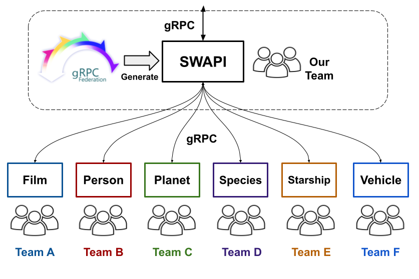

# SWAPI powered by gRPC Federation

Here is an example of building a simple service using gRPC Federation with SWAPI.

## What is SWAPI ?

[SWAPI](https://swapi.dev/) is one of the public APIs. It frequently appears as an example for GraphQL and gRPC, so we are using it with gRPC Federation as well.

## Background and Architecture

The service we are building this time with gRPC Federation is a BFF (Backend for Frontend) that consolidates the results of several pre-existing services ( `film` , `person` , `planet` , `species` , `starship` , `vehicle` ).
Please consider these pre-existing services as in-house microservices in a real-world scenario.
Each of them is developed and managed by a different team.

Each microservice exposes internal APIs using gRPC, with schemas managed by Protocol Buffers.
Our goal is to build a gRPC service that aggregates the necessary information from each service and exposes it externally.

[](./images/arch.png)

## How to use

The Protocol Buffers files for each microservice are located under the `./proto` directory. Additionally, we will create the `swapi.proto` file for this project, which is already placed in `./proto/swapi.proto` .

The `swapi.proto` file contains the API schema and the gRPC Federation options.

The following is an excerpt from it.

- swapi.proto

```proto
// GetPersonReply message for SWAPI.
message GetPersonReply {
  // gRPC Federation Options.
  option (grpc.federation.message) = {
    def {
      name: "res"
      call {
        method: "swapi.person.PersonService/GetPerson"
        request { field: "id" by: "$.id" }
      }
    }
    ...
  };
}
```

In this demo, we will use `Buf` to generate code from the proto files utilizing gRPC Federation. First, you need to install the Buf CLI by running the following command:

```console
make tools
```

If the installation is successful, the `buf` and `ko`  and `grpcurl` binaries will be installed under the `bin` directory.

To generate code using Buf, execute the following command:

```console
make generate
```

The code will be generated under the `./swapi/swapi` directory.

Next, build the server and create the image. In this demo, it's necessary to start other microservices simultaneously, so the code for each is also provided. To build the code for all services and create images, execute the following command:

```console
make build
```

Finally, start all services. Use `docker compose` for launching. The SWAPI service will be available on port `3000`. ( See [config file](./compose.yaml) )

```console
make up
```

Now, let's send a request to confirm the functionality. If you receive a response after sending a request like the following, the application is running successfully.

```
./bin/grpcurl -plaintext -d '{"id": 1}' localhost:3000 swapi.SWAPI/GetPerson
```

Additionally, we are using [JAEGER](https://www.jaegertracing.io/) to visualize OpenTelemetry traces. It is exposed on port `4000`, so please try accessing it in your browser. If you can see a page like the following, it means it's successful.

- `http://localhost:4000`

[](./images/jaeger.png)

## Conclusion

The team responsible for providing the SWAPI service needs to develop and maintain only the `swapi.proto` file and the `./cmd/swapi/main.go` file. The `swapi.proto` file utilizes gRPC Federation. In the `./cmd/swapi/main.go` file, additional tasks such as defining gRPC clients, which cannot be described solely with gRPC Federation, need to be addressed.

Please feel free to edit the `swapi.proto` file and explore the capabilities of gRPC Federation !!!
